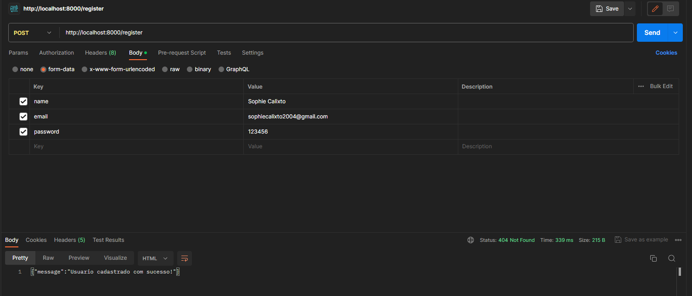

Study project using JWT authentication with Pure PHP

 

## Installation

```bash
git clone https://github.com/sophiecalixto/php-jwt-authentication.git
composer install
```

## Usage

```bash
php -S localhost:8000 -t public/
```

> If you using postgresql, you can use migrations to create tables

@Windows
```bash
composer migration-tokens-win
composer migration-tasks-win
composer migration-users-win
```
@LInux
```bash
composer migration-users
composer migration-tasks
composer migration-tokens
```

## Request methods

### User

| Method | Endpoint  | Description |
| ------ |-----------| ------ |
| POST | /register | Create a new user |
| POST | /login    | Login user |

In Register use this JSON format:

```json
{
    "name": "Sophie Calixto",
    "email": "sophiecalixto2004@gmail.com",
    "password": "123456"
}
```

In Login use this JSON format:

```json
{
    "email": "sophiecalixto2004@gmail.com",
    "password": "123456"
}
```

**If login successful and returns a token, store this and pass in new requests**



### Tasks

| Method | Endpoint   | Description       |
|--------|------------|-------------------|
| POST   | /tasks     | Create a new task |
| GET    | /tasks     | List all tasks    |
| GET    | /task/{id} | Return task by id |
| PUT    | /task/{id} | Update task       |
| DELETE | /task/{id} | Delete task       |

* PUT JSON FORMAT

```json
{
    "title": "New project title",
    "description": "New project Description"
}
```